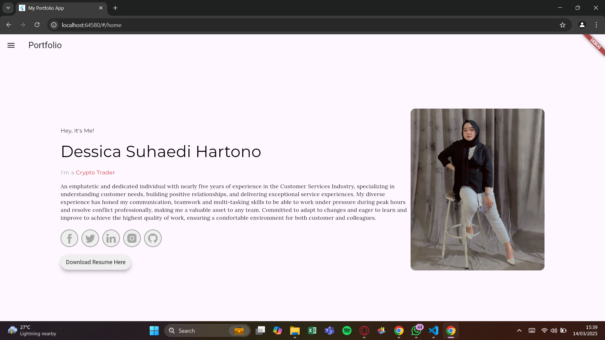
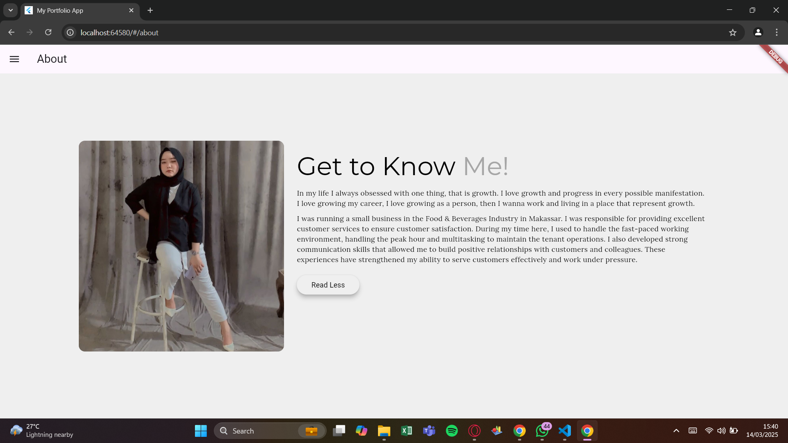
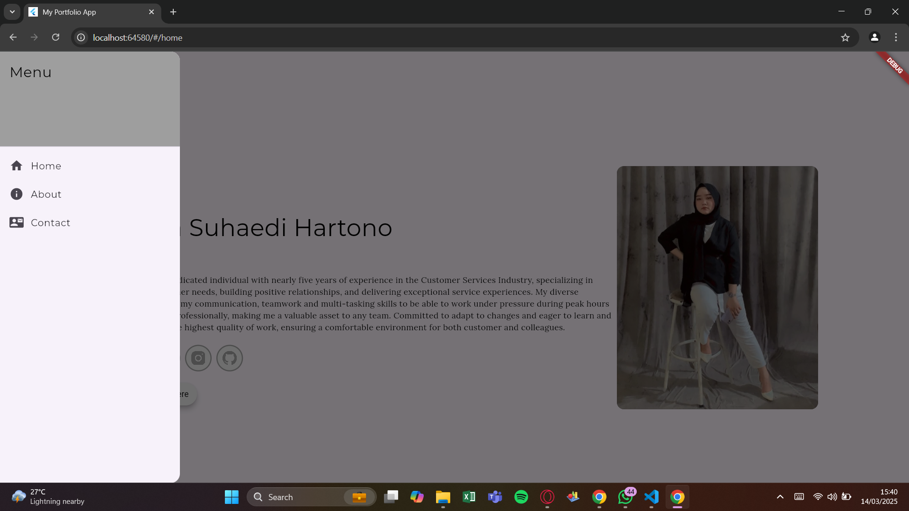
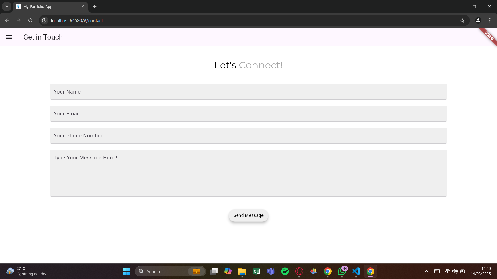

# My Portfolio App

Selamat datang di proyek **Portfolio Flutter App**! Aplikasi ini adalah contoh aplikasi Flutter yang menampilkan portofolio dengan navigasi sederhana.

## Fitur

- Halaman HomePage
- Halaman About
- Halaman Contact
- Navigasi Menu

## Screenshot

Berikut adalah beberapa tangkapan layar dari aplikasi:

### Halaman Utama

### Halaman Tentang

### Navigasi Menu

### Halaman Kontak

### Penggunaan

Setelah aplikasi berjalan, Anda dapat menavigasi antara halaman menggunakan menu yang tersedia di drawer. Anda dapat melihat informasi tentang aplikasi di halaman "About" dan menghubungi kami melalui halaman "Contact"

### Teknologi yang Digunakan
- Dart - Bahasa pemrograman yang digunakan dalam pengembangan aplikasi.
- Flutter - Framework untuk membangun aplikasi.
